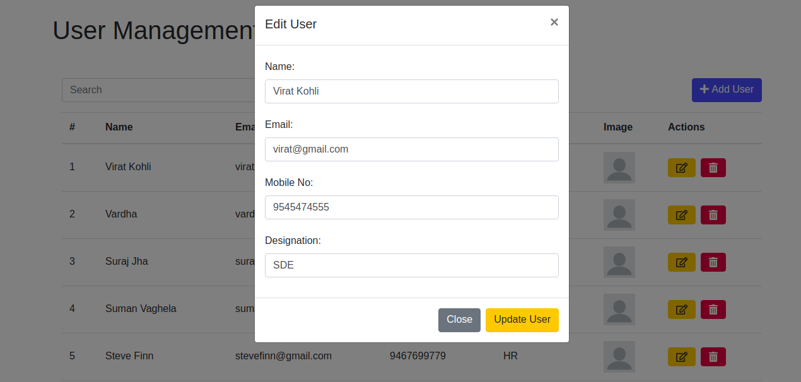

# User Management Portal

## Technologies Used:
Project is created with:
* NodeJS 
* Angular 11

## Features:
* CRUD application with MongoDB.
* Frontend is built using Angular 11 and Backaend is on NodeJS.
* The application supports Searching, Sorting and lazy loading of data.
* Searching and Sorting are implemented using MongoDB Indexes.

## Screenshots
### Listing

### Search Result

### Add User Modal

### Edit User Modal

